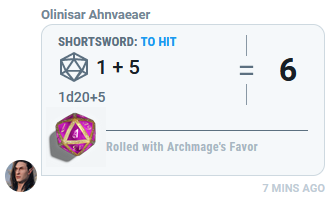
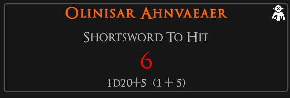
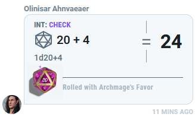
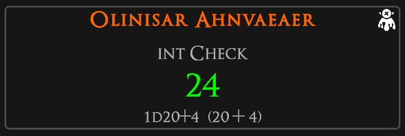
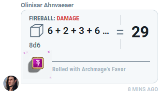
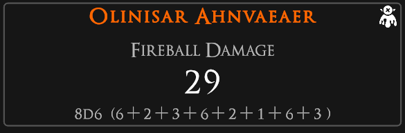

# ddb_observeGameLog

A Symbiote to watch the D&D Beyond Game Log from a Campaign and report the rolls into TaleSpire. This was made
for groups who may not have all members within TaleSpire - to allow folks to roll within D&D Beyond and still
have the results ported to where those in TaleSpire can see the result in the in software chat log.

# Loading into TaleSpire
Place the `ddb_observeGameLog` folder into `%AppData%\..\LocalLow\BouncyRock Entertainment\TaleSpire\Symbiotes\`.
Upon loading TaleSpire's Symbiotes, you will see one labeled **D&D Beyond Game Log Observer**.

# Usage
When loaded up, the Symbiote will attempt to load directly to https://www.dndbeyond.com/my-campaigns.
You'll likely need to login, and perhaps prove you're human to D&D Beyond.
You can then navigate to the campaign you wish to observe and open up the Game Log.

Once the Game Log is opened, that's it! Any roll in made in D&D Beyond within that campaign will now report out to
the TaleSpire Chat Log. The Symbiote even has permission to run in the background and will not need to stay open on
your screen in order to report, so long as you don't close it from running overall.

# Examples
## Natural 1

## Natural 20

## Lots o' Dice

